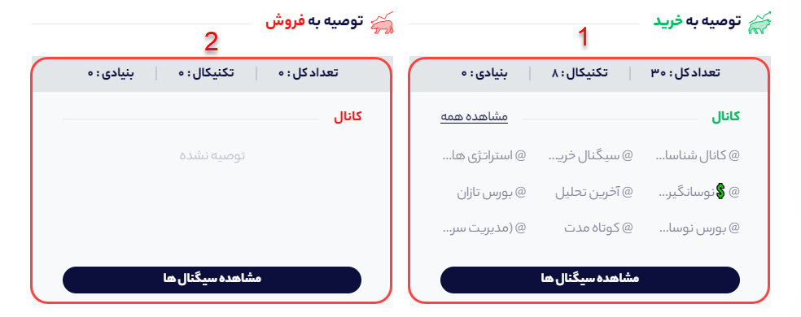
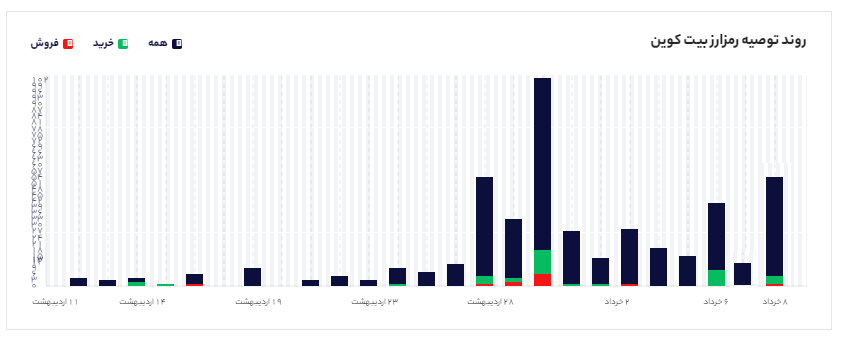
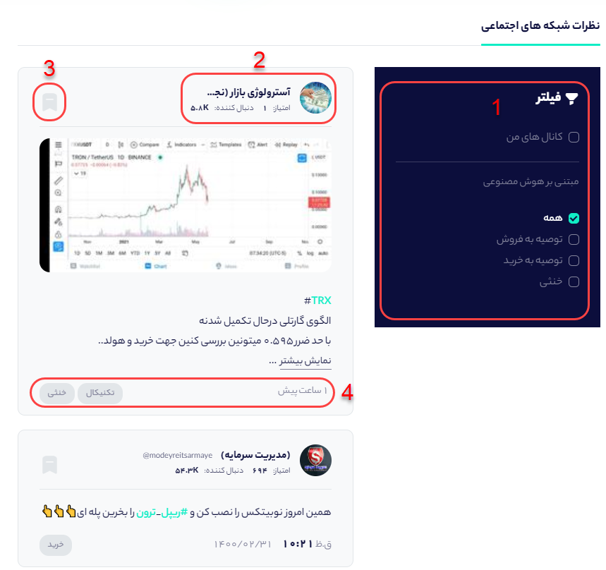

# صفحه رمز ارز

در صفحه رمزارزها علاوه بر مشاهده اطلاعات کلی هر رمزارز مانند : نمودار قیمت، حجم معامله و.... می‌توانید اطلاعات و پیام‌های درج شده از هر رمز ارز را در شبکه‌های اجتماعی مشاهده کنید.



در تب شبکه اجتماعی می‌توانید اطلاعات قیمتی و شبکه اجتماعی هر رمزارز را مشاهده کنید.

**1- قیمت رمرارز \(ارز دیجیتال\):** در این بخش می‌توانید قیمت رمزارز مربوطه را به دلار، تومان و تتر مشاهده کنید.

**2- معاملات روزانه:** ارزش معاملات یک رمزارز معامله شده را نشان می‌دهد به طور دقیقتر تعداد رمزارز معامله شده ضربدر قیمت آن رمزارز ارزش یک معامله را مشخص می کند که مجموع تمامی معاملات در 24 ساعت اخیر را معاملات روزانه می نامند

**3- حجم بازار:** ارزش کلیه ی رمزارزهای در گردش را نشان می‌دهد. حجم بازار، شاخصی برای اندازه‌گیری ارزش یک بازار خاص است. به طور دقیقتر تعداد رمزارزهای در گردش شده ضربدر قیمت آن رمزارز، ارزش حجم بازار را مشخص می کند. به عنوان مثال اگر قیمت هر واحد بیت کوین ۱۰,۰۰۰ دلار باشد و تعداد بیت کوین‌های در گردش ۱۷,۰۰۰,۰۰۰ میلیون باشد، ارزش بازار بیت کوین برابر است با ۱۰,۰۰۰ ضربدر ۱۷,۰۰۰,۰۰۰ که مساوی است با ۱۷۰,۰۰۰,۰۰۰,۰۰۰ دلار یا به عبارتی ۱۷۰ میلیارد دلار.

**4- سکه در گردش:** عرضه در گردش یا سرمایه در گردش یا \(Circulating Supply\)، به تعدادی از توکن ها یا رمزارزهای استخراج شده یا تولید شده که به‌شکل عمومی در دسترس و در گردش هستند می گویند. درمقابل، عرضه کل یا کل سکه ها به تعداد سکه‌ها یا توکن‌هایی اطلاق می‌گردد که در حال حاضر وجود دارند و می‌تواند هم به صورت در گردش و هم به صورت قفل شده‌ باشند. به عنوان مثال، سکه در گردش بیت‌کوین به‌تدریج تا حداکثر 21 میلیون کوین افزایش خواهد یافت و این افزایش تدریجی مربوط به فرآیند استخراج است

**5- حجم امروز/کل:** به نسبت حجم معاملات روزانه تقسیم بر حجم بازار می گویند. که می تواند نشانگری از میزان فعالیت بازار آن رمزارز در امروز باشد.

**6- افزودن به سبد  یا نحوه‌ی بوکمارک کردن رمزارز:** اگر شما می‌خواهید رمزارز مورد نظر را در لحظه رصد کنید می‌توانید با کلیک روی افزودن به سبد، رمزارز را به بخش سبدگرافی اضافه کنید تا اگر تغییراتی در مقدار سیگنال‌های خرید و فروش آن به وجود آمد بدون ورود به صفحه رمزارز آنرا ببینید.

**7- نظردهی در مورد رمزارز:** در این بخش می‌توانید حس خود را نسبت به رمزارز بیان کنید. اگر فکر می‌کنید این رمزارز برای سرمایه‌گذاری مناسب است حس خوب و اگر فکر می‌کنید مناسب نیست حس بد را بزنید.

### نمودار قیمت لحظه‌ای رمزارز:

در این بخش می‌توانید نمودار و قیمت لحظه‌ای هر رمزارز را مشاهده کنید و بر اساس بازه‌ای که مورد نظرتان هست نمودار روند قیمتی را تغییر دهید.

**1- قیمت به دلار:** در این بخش می‌توانید قیمت لحظه‌ای دلاری هر رمزارز را در آخرین روز معاملاتی مشاهده کنید.

**2- تغییرات قیمت نسبت به روز قبل:** در این بخش شما می‌توانید ببینید که قیمت امروز هر رمزارز نسبت به دیروز چقدر تغییر داشته است اگر رنگ سبز باشد یعنی افزایش قیمت را داشته‌ایم و اگر قرمز یعنی قیمت رمزارز نسبت به دیروز کاهش داشته است.

**3-انتخاب بازه روند قیمتی:** شما می‌توانید بازه روند قیمتی را در کادر مشخص شده تغییر دهید. روند قیمتی به صورت پیش فرض روی یکسال اخیر تنظیم شده است ولی شما می‌توانید با کلیک روی 1D، 1M، 3M به ترتیب روند قیمیتی را بر حسب روزاخیر، ماه اخیرو سه ماه اخیر تغییر دهید.

### نحوه‌ی مشاهده تعداد سیگنال‌های خرید و فروش هر رمزارز در کانال‌های تلگرامی:

هر تحلیلگری برای سیگنال‌دهی خود روش خاصی دارد. برخی از آن‌ها بر اساس تحلیل تکنیکال سیگنال خرید یا فروش صادر می‌کنند و برخی دیگر بر اساس تحلیل بنیادی سیگنال می‌دهند. همانطور که در تصویر مشخص است در کادر **1** که سیگنال‌های خرید به تفکیک تحلیل تکنیکال و بنیادی آمده است، تعداد کل سیگنال‌های خرید 30 عدد بوده که از این تعداد 8 سیگنال بر اساس تحلیل تکنیکال بوده است و 0 سیگنال نیز بر اساس تحلیل بنیادی صادر شده است. مابقی سیگنال‌ها نیز بر اساس سخن تحلیلگر بوده است. در کادر **2** نیز تعداد سیگنال‌های فروش بر اساس تحلیل بنیادی و تکنیکال آمده است. 

نکته: برای مشاهده متن سیگنال‌های خرید و فروش کافیست روی **مشاهده سیگنال‌ها** کلیک کنید تا به بخش متن توصیه‌ها بروید.

### روند توصیه رمزارزها:

در مشاهده روند توصیه‌های خرید،فروش و خنثی در یک ماه اخیر می‌توانید از این نمودار استفاده کنید. میله سبز مربوط به تعداد سیگنال‌های خرید، میله قرمز مربوط به تعداد سیگنال‌های فروش و رنگ سرمه‌ای نیز تعداد سیگنال‌های خنثی \( نه سیگنال خرید هستند نه سیگنال فروش\) را نشان می‌دهد.

### **مشاهده نظرات تحلیلگران کانال های تلگرامی در مورد هر نماد:**

در بخش نظرات شبکه‌های اجتماعی شما می‌توانید کلیه‌ی نظرات تحلیلگران در مورد هر نماد را مطالعه کنید. از بخش 1 که در تصویر نشانه‌گذاری شده است می‌توانید فیلترهای مورد نظر را اعمال کنید. به عنوان مثال با فعال کردن تیک توصیه به خرید و فروش فقط نظراتی که سیگنال خرید یا فروش را داشته‌اند مشاهده کنید و نظرات ختثی برای شما به  نمایش در نیاید.

**نکته مهم:** اگر شما فیلتر کانال‌های من را فعال کنید، تنها پیام‌های کانال‌هایی که شما به لیست علاقه مندی اضافه کردید و در مورد آن نماد صحبت کرده است نمایش داده می‌شود.








