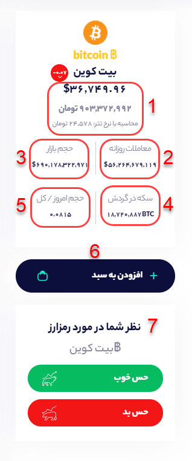

# صفحه رمز ارز

در صفحه رمزارزها علاوه بر مشاهده اطلاعات کلی هر رمزارز مانند : نمودار قیمت، حجم معامله و.... می‌توانید اطلاعات و پیام‌های درج شده از هر رمز ارز را در شبکه‌های اجتماعی مشاهده کنید.

1- قیمت رمرارز \(ارز دیجیتال\): در این بخش می‌توانید قیمت رمزارز مربوطه را به دلار، تومان و تتر مشاهده کنید.

2- معاملات روزانه: ارزش معاملات یک رمزارز معامله شده را نشان می‌دهد به طور دقیقتر تعداد رمزارز معامله شده ضربدر قیمت آن رمزارز ارزش یک معامله را مشخص می کند که مجموع تمامی معاملات در 24 ساعت اخیر را معاملات روزانه می نامند

3- حجم بازار: ارزش کلیه ی رمزارزهای در گردش را نشان می‌دهد. حجم بازار، شاخصی برای اندازه‌گیری ارزش یک بازار خاص است. به طور دقیقتر تعداد رمزارزهای در گردش شده ضربدر قیمت آن رمزارز، ارزش حجم بازار را مشخص می کند. به عنوان مثال اگر قیمت هر واحد بیت کوین ۱۰,۰۰۰ دلار باشد و تعداد بیت کوین‌های در گردش ۱۷,۰۰۰,۰۰۰ میلیون باشد، ارزش بازار بیت کوین برابر است با ۱۰,۰۰۰ ضربدر ۱۷,۰۰۰,۰۰۰ که مساوی است با ۱۷۰,۰۰۰,۰۰۰,۰۰۰ دلار یا به عبارتی ۱۷۰ میلیارد دلار.

4- سکه در گردش: عرضه در گردش یا سرمایه در گردش یا \(Circulating Supply\)، به تعدادی از توکن ها یا رمزارزهای استخراج شده یا تولید شده که به‌شکل عمومی در دسترس و در گردش هستند می گویند. درمقابل، عرضه کل یا کل سکه ها به تعداد سکه‌ها یا توکن‌هایی اطلاق می‌گردد که در حال حاضر وجود دارند و می‌تواند هم به صورت در گردش و هم به صورت قفل شده‌ باشند. به عنوان مثال، سکه در گردش بیت‌کوین به‌تدریج تا حداکثر 21 میلیون کوین افزایش خواهد یافت و این افزایش تدریجی مربوط به فرآیند استخراج است

5- حجم امروز/کل: به نسبت حجم معاملات روزانه تقسیم بر حجم بازار می گویند. که می تواند نشانگری از میزان فعالیت بازار آن رمزارز در امروز باشد.

6- افزودن به سبد  یا نحوه‌ی بوکمارک کردن رمزارز: اگر شما می‌خواهید رمزارز مورد نظر را در لحظه رصد کنید می‌توانید با کلیک روی افزودن به سبد، رمزارز را به بخش سبدگرافی اضافه کنید تا اگر تغییراتی در مقدار سیگنال‌های خرید و فروش آن به وجود آمد بدون ورود به صفحه رمزارز آنرا ببینید.

7- نظردهی در مورد رمزارز: در این بخش می‌توانید حس خود را نسبت به رمزارز بیان کنید. اگر فکر می‌کنید این رمزارز برای سرمایه‌گذاری مناسب است حس خوب و اگر فکر می‌کنید مناسب نیست حس بد را بزنید.

