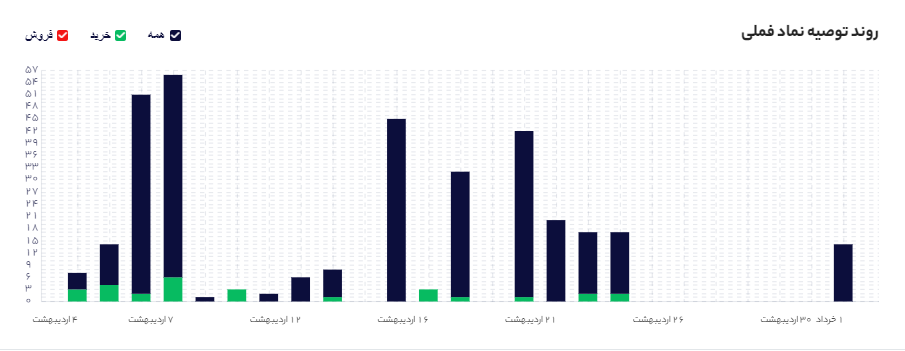
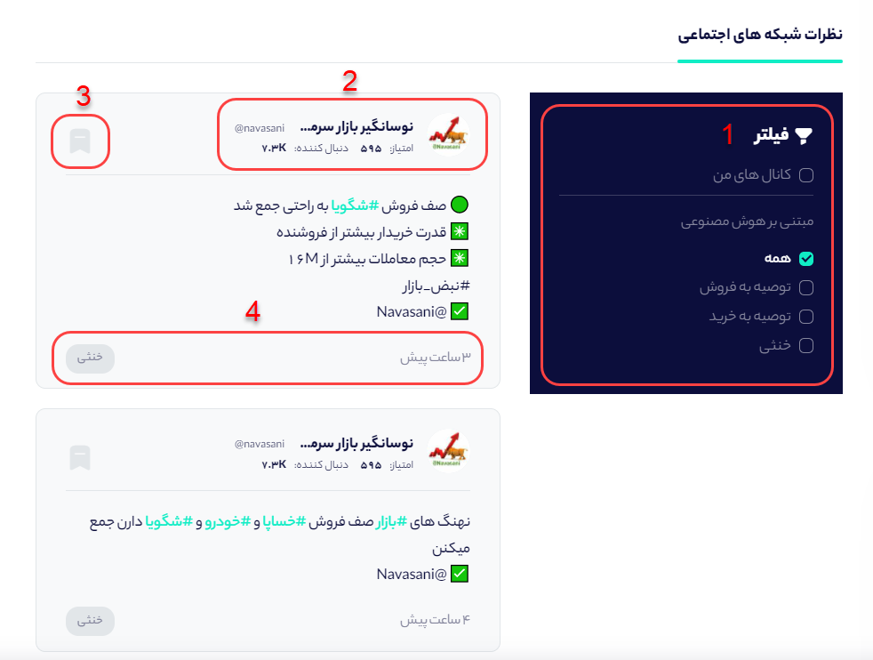
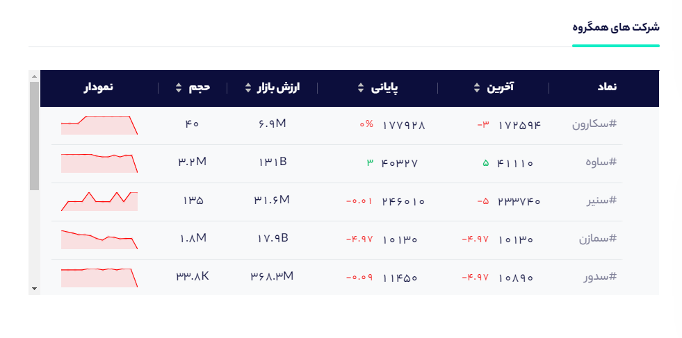
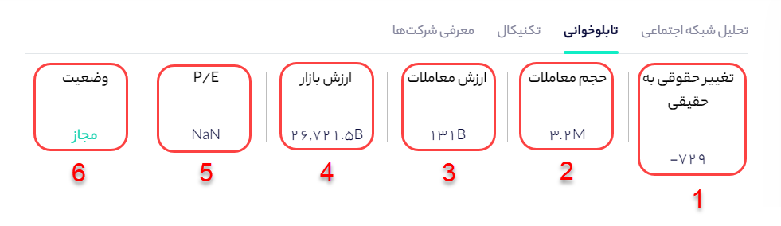
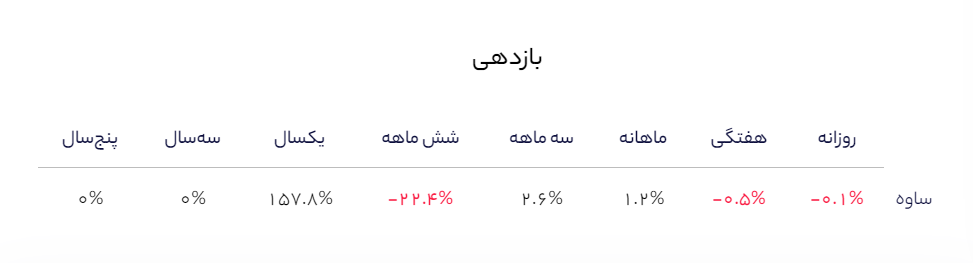
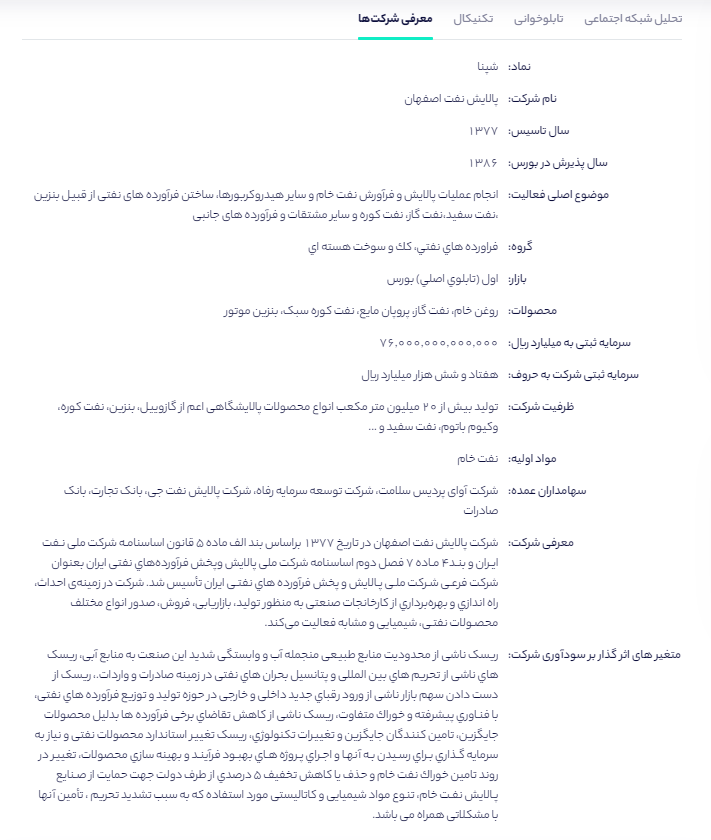

# صفحه نماد

درصفحه نماد اطلاعات مهمی مانند داده‌های شبکه‌های اجتماعی، اطلاعات بنیادی سهم، وضعیت تابلوخوانی و تکنیکال آورده شده است که هر بخش را به صورت کامل توضیح خواهیم داد. 




در بخش تحلیل شبکه‌ اجتماعی اطلاعات کلی نماد و نطرات تحلیلگران در مورد سهم مربوطه گنجانده شده است.

### اطلاعات قیمتی سهم

زمانی که وارد صفحه نماد می‌شوید در بخش راست می‌توانید اطلاعات قیمتی مربوط به نماد را مشاهده کنید که هر یک مفهوم خاصی را دارد. 

**1- آخرین معامله:** نمایش دهنده قیمت آخرین معامله سهم در هنگام باردید از صفحه معاملات است.

**2- پایانی امروز:** نمایش دهنده میانگین موزون قیمت‌های معامله شده سهم در روز آخر معاملاتی را نشان می‌دهد.

**3- کمترین قیمت:** این بخش نمایش دهنده کمترین قیمتی است که سهم در آخرین روز معاملاتی معامله شده است.

**4- بیشترین قیمت:** این بخش نمایش دهنده بیشترین قیمتی است که سهم در آخرین روز معاملاتی معامله شده است.

**5- بازگشایی:** اولین قیمتی که سهم در آخرین روز معامله شده است را نشان می‌دهد.

**6- پایانی دیروز:** نمایش دهنده میانگین موزون قیمت‌های معامله شده سهم در روز معاملاتی قبل را نشان می‌دهد.

### امتیاز خرید و فروش هر نماد چیست؟

سهمتو برای اینکه شما بتوانید به ارزیابی مشخصی از وضعیت سهم در شبکه‌های اجتماعی برسید، امتیازی برای سیگنال‌های خرید و فروش سهم تعیین کرده است. مبنای این امتیاز دهی به اینگونه است که هر چه سیگنال خرید یا فروش یک نماد جدیدتر باشد، امتیاز و اعتبار آن بالاتر می‌رود. به  طوری که جدیدترین سیگنال امتیاز 100 و قدیمی ترین سیگنال امتیاز 0 را دریافت می‌کند. میانگین این امتیازها برای تمام سیگنال‌های یک سهم، به صورت امتیاز آن سهم در بخش نماد نمایش داده می‌شود که عددی بین 0 تا 100 است. عدد **1** و **4** تصویر امتیاز خرید و فروش یک سهام را مشخص کرده است. و بخش رتبه در بین نمادها نیز رتبه نماد از نظر سیگنال خرید و فروش را در بین تمام نمادهای بورسی نشان می‌دهد.

**نکته : هر چه امتیاز خرید از فروش بالاتر باشد بدین معناست که سیگنال های خریدی که برای سهم داده شده است نسبت به سیگنال های فروش سهم تازه تر است.**

بخش **2** و **3** که در تصویر زیر مشخص شده است فیلترهای مثبت و منفی سهم در شبکه‌های اجتماعی را نشان می‌دهد. به عنوان مثال اگر به طور ناگهانی سیگنال‌های خرید زیادی در مورد سهم در کانال‌های بورسی صادر گردد، سهمتو این موضوع را به عنوان یک فیلتر مثبت در نظر می‌گیرد و در بخش فیلتر مثبت می‌آورد. 

### چه تعداد از سیگنال‌های خرید و فروش یک سهم از منظر تحلیل تکنیکال و بنیادی بوده‌اند؟

هر تحلیلگری برای سیگنال‌دهی خود روش خاصی دارد. برخی از آن‌ها بر اساس تحلیل تکنیکال سیگنال خرید یا فروش صادر می‌کنند و برخی دیگر بر اساس تحلیل بنیادی سیگنال می‌دهند. همانطور که در تصویر مشخص است در کادر **1** که سیگنال‌های خرید به تفکیک تحلیل تکنیکال و بنیادی آمده است، تعداد کل سیگنال‌های خرید 30 عدد بوده که از این تعداد 8 سیگنال بر اساس تحلیل تکنیکال بوده است و 0 سیگنال نیز بر اساس تحلیل بنیادی صادر شده است. مابقی سیگنال‌ها نیز بر اساس سخن تحلیلگر بوده است. در کادر **2** نیز تعداد سیگنال‌های فروش بر اساس تحلیل بنیادی و تکنیکال آمده است. 

نکته: برای مشاهده متن سیگنال‌های خرید و فروش کافیست روی **مشاهده سیگنال‌ها** کلیک کنید تا به بخش متن توصیه‌ها بروید.

### روند توصیه نماد:

در مشاهده روند توصیه‌های خرید،فروش و خنثی در یک ماه اخیر می‌توانید از این نمودار استفاده کنید. میله سبز مربوط به تعداد سیگنال‌های خرید، میله قرمز مربوط به تعداد سیگنال‌های فروش و رنگ سرمه‌ای نیز تعداد سیگنال‌های خنثی \( نه سیگنال خرید هستند نه سیگنال فروش\) را نشان می‌دهد.

**مشاهده نظرات تحلیلگران کانال های تلگرامی در مورد هر نماد:**

در بخش نظرات شبکه‌های اجتماعی شما می‌توانید کلیه‌ی نظرات تحلیلگران در مورد هر نماد را مطالعه کنید. از بخش 1 که در تصویر نشانه‌گذاری شده است می‌توانید فیلترهای مورد نظر را اعمال کنید. به عنوان مثال با فعال کردن تیک توصیه به خرید و فروش فقط نظراتی که سیگنال خرید یا فروش را داشته‌اند مشاهده کنید و نظرات ختثی برای شما به  نمایش در نیاید.

**نکته مهم:** اگر شما فیلتر کانال‌های من را فعال کنید، تنها پیام‌های کانال‌هایی که شما به لیست علاقه مندی اضافه کردید و در مورد آن نماد صحبت کرده است نمایش داده می‌شود.

در بخش **2** تصویر بالا، نام کانال، امتیاز سهم تو به کانال و تعداد اعضای کانال قابل مشاهده است. به عنوان مثال در تصویر بالا کانال نوسانگیر بازار سرمایه با امتیاز 595 و تعداد دنبال کننده 7.3 هزار در مورد نماد شگویا چنین پیامی را در کانال خود درج کرده است. 

اگر شما نیاز داشتید که این پیام را مجددا ببینید بدون اینکه به صفحه نماد مراجعه کنید می‌توانید از قسمت **3** با کلیک بر روی آیکون پیام مورد نظر را ذخیره کنید. پیام ذخیره شده در بخش پروفایل قابل مشاهده است. در کادر **4** نیز می‌توانید زمان انتشار پیام و نوع پیام تشخیص داده شده توسط هوش مصنوعی را مشاهده کنید.

### چگونه نماد بورسی را به سبد سهام خود برای رصد لحظه‌ای اضافه کنیم؟

برای اضافه کردن نماد به بخش سبدگردانی کافیست از قسمت سمت راست صفحه نماد مطابق شکل زیر روی افزودن به سبد کلیک کنید تا نماد به بخش سبدگردانی در صفحه دیده‌بان اضافه گردد.  همچنین شما می‌توانید نظرات خود را در مورد هر نماد در قالب حس خوب و حس بد بیان کنید. برای این کار کافیست مطابق شکل زیر \(گزینه 2\) را اضافه کنید. 

### **شرکت‌های گروه**:

در این بخش می‌توانید شرکت‌هایی که از لحاظ تولید و نوع شرکت شبیه سهم مورد نظر هست را مشاهده کنید. 




در بخش تابلو خوانی می‌توانید میزان تغییر حقوقی به حقیقی، حجم و ارزش معاملات روز، ارزش بازار و وضعیت نماد را مشاهده کنید. 

**1- تغییر حقوقی به حقیقی:**  زمانی که می گوییم تغییر مالکیت ها مثلا در فلان روز از حقوقی به حقیقی بوده است، یعنی نقدینگی از پرتفوی سهامداران حقوقی به پرتفوی سهامداران حقیقی انتقال یافته است، و یا به عبارت دیگر سهامداران حقوقی بیشتر فروشنده و سهام خود را فروخته و سهامداران حقیقی خریدار بوده اند، در عکس بالا یعنی حقوقی ها بیشتز از حقیقی ها خریدار بودند چون عدد منفی است. 

**2- حجم معاملات**: نشان دهنده‌ی تعداد سهام معامله شده در آخرین روز معاملاتی سهم است.

**3- ارزش معاملات:** این شاخص نشان دهنده میزان ارزش روز آخرین روز معاملاتی سهم است که از ضرب حجم معاملات درقیمت پایانی سهم در همان روز به دست می‌آید.

**4- ارزش بازار:** این شاخص به شما نشان می‌دهد که کل شرکت چقدر میارزد که حاصل ضرب کل سهام شرکت در قیمت پایانی همان روز به دست می‌آید.

**5- قیمت بر سود \(P/E\):** از تقسیم قیمت پایانی سهم بر سودی که سهام می‌سازد نسبت P/E به دست می‌آید.

**6- وضعیت سهم:** این بخش به شما می‌گوید که سهم در آخرین روز معاملاتی چه وضعیتی داشته است. آیا سهم بسته بوده یا باز بوده است.

### بازدهی سهم در بازه‌های مختلف:

در این بخش شما می‌توانید بازدهی سهم در بازه های مختلف مانند روز، هفته، ماه، سال و.... را مشاهده کنید.




در بخش تحلیل تکنیکال، سهمتو با تحلیل اندیکاتورهای مختلف مانند rsi، mfi، macd و میانگین های متحرک تحلیلی کلی از وضعیت تکنیکال سهم به شما ارائه می‌کند.

**1- خلاصه تحلیل تکنیکال میانگین های متحرک:** 

در این قسمت سهمتو بر اساس وضعیت سیگنال دهی میانگین متحرک های 5، 10، 20 و 50 ، سیگنال خرید و فروش و خنثی را نشان می‌دهد. سپس در این بخش می‌توانید خلاصه این تحلیل ها را مقایسه کنید و در آخر ببینید که چندتا از این میانگین های متحرک سیگنال خرید و یا فروش می‌دهند و اگر هم در وضعیت خنثی باشد یعنی سیگنالی برای خرید و فروش از میانگین‌های متحرک برای این سهم صادر نشده است.

**2- خلاصه تحلیل تکنیکال نشانگرهای** **تکنیکال** \(**شاخص های فنی\):**

اندیکاتورهایی نظیر RSI،MACD،MFI جزو اندیکاتورهایی است که اغلب تحلیلگران برای پیدا کردن موقعیت خرید و فروش مناسب از آن‌ها استفاده می‌کنند. در این بخش خلاصه وضعیت سیگنال‌دهی سه اندیکاتور پر کاربرد را می‌توانید مشاهده کنید. اگر اندیکاتورها در وضعیت خرید یا فروش باشند شما می‌توانید بر حسب همان به خرید و فروش سهام اقدام کنید. وضعیت ختثی نیز بدان معناست که اندیکاتورها سیگنالی برای خرید و فروش نمی‌دهند و روند سهم ساید است.H



در این بخش اطلاعات جامعی از شرکت مانند زمان تاسیس، سال ورود به بورس، موضوع فعالیت شرکت، محصولات، مواد اولیه مصرفی و متغیرهایی که روی سودآوری شرکت تاثیر می‌گذارد در یکجا به صورت خلاصه آمده است.




\*\*\*\*

\*\*\*\*

\*\*\*\*

