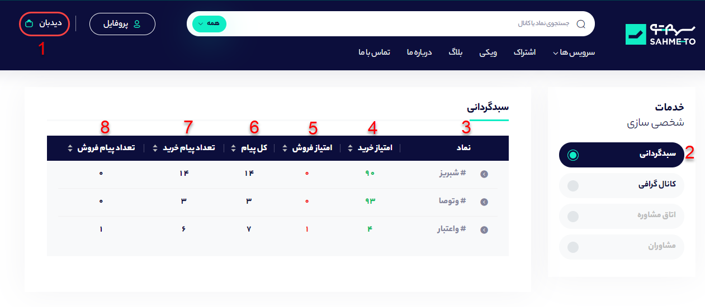

# سبدگردانی

برای اینکه به بخش سبدگردانی وارد شوید و بتوانید سهم‌هایی که قبلا بوکمارک کرده‌اید در یکجا مشاهده کنید در ابتدا باید روی گزینه دیده‌بان که در تصویر زیر با عدد **1** مشخص شده است کلیک کنید. سپس بخش سبدگردانی که با شماره **2** مشخص شده است  را از میان بخش‌های مختلف صفحه  دیده‌بان انتخاب کنید.

**3- نماد:** در این بخش نمادهایی که شما از بخش نماد بوکمارک کرده‌اید نمایش داده می‌شود. ****

**4- امتیاز خرید:** سیگنال‌های مختلفی که برای هر سهم در کانال‌های تلگرامی ثبت می‌شوند، از نظر امتیاز با یکدیگر متفاوت هستند. هر چه سیگنال خرید جدیدتر باشد امتیاز و اعتبار آن بالاتر است، به طوری که جدیدترین سیگنال امتیاز 100 و قدیمی ترین سیگنال امتیاز 0 را دریافت می‌کند. میانگین این امتیازها برای تمام سیگنال‌های یک سهم، به صورت امتیاز آن سهم در بخش نماد نمایش داده می‌شود که عددی بین 0 تا 100 است.

**5- امتیاز فروش:** هر چه سیگنال های فروشی کانال‌های تلگرامی در مورد سهم داده‌اند جدیدتر باشد، نماد امتیاز فروش بالاتری خواهد داشت.

**6- کل پیام:** این بخش تعداد کل پیام‌هایی که در مورد سهم در کانال های تلگرامی آمده است را نشان می‌دهد. ****

**7- تعداد پیام خرید:** این کادر فقط تعداد پیام‌هایی که توسط هوش مصنوعی سهمتو سیگنال خرید تشخیص داده شده است را نشان می‌دهد.

**8- تعداد پیام فروش:** این کادر فقط تعداد پیام‌هایی که توسط هوش مصنوعی سهمتو سیگنال فروش تشخیص داده شده است را نشان می‌دهد.

### چگونه نمادی را از قسمت سبدگردانی حذف کنیم؟

برای این کار کافیست روی علامت مشخص شده در تصویر کلیک کنید و سپس روی دکمه **حذف کردن این نماد** کلیک کنید تا نماد مورد نظر ار ضفحه سبدگردانی حذف گردد.

\*\*\*\*

