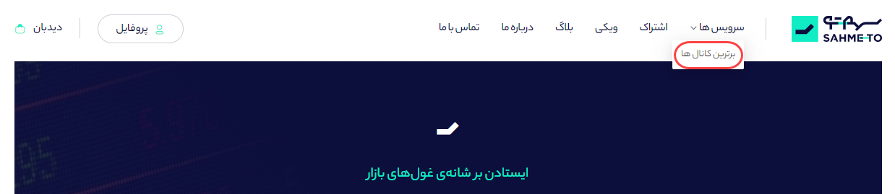
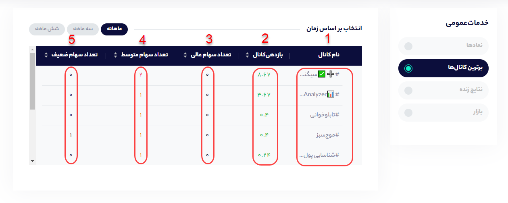

# کانال های برتر

سهمتو اطلاعات بیش از 500 کانال بورسی را جمع‌آوری و بر اساس هوش مصنوعی سبد پیشنهادی هر کانال را استخراج میکند و بر اساس زمان معرفی هر سهم بازدهی ماهانه سبد پیشنهادی هر کانال را محاسبه می‌کند. برای اینکه شما بتوانید 10 کانال برتر این مجموعه را ببینید کافیست از قسمت سرویس‌ها، روی برترین کانال‌ها کلیک کنید تا به صفحه برترین کانال ها منتقل شوید.

### صفحه برترین کانال ها چه چیزی را نشان می‌دهد؟

در صفحه برترین ها کانال ها می توانید اطلاعات زیر را مشاهده کنید:

**1- نام کانال:** در این بخش می توانید نام کانال‌هایی که جزو ده کانال برتر بورسی از لحاظ سیگنال دهی را ببیند و با کلیک روی نام ها نیز به صفحه آن کانال در سهمتو منتقل شوید.

**2- بازدهی کانال:** این بخش بازدهی سبد پبشنهادی کانال در ماه اخیر را نشان می‌دهد. در واقع این بخش نشان‌دهنده‌ی عملکرد کلی کانال در بخش سیگنال دهی است. اما اگر شما بخواهید عملکرد سه ماهه و شش ماهه کانال را نیز ببینید کافیست از انتخاب زمان، بازه مورد نظر خود را انتخاب کنید.

**3- تعداد سهام عالی:** سهم معرفی شده در کانال اگر در بازه یک ماه نسبت به شاخص کل بازدهی بالاتری داشته باشد، سهمتو آن سهم را سهام عالی در نظر می‌گیرد که با رنگ سبز مشخص شده است.

**4- تعداد سهام متوسط:** سهم معرفی شده در کانال اگر در بازه یک ماه نسبت به شاخص کل بازدهی برابری داشته باشد، سهمتو آن سهم را سهام متوسط در نظر می‌گیرد که با رنگ سرمه‌ای مشخص شده است.

**5- تعداد سهام ضعیف:** سهم معرفی شده در کانال اگر در بازه یک ماه نسبت به شاخص کل بازدهی پایین تری داشته باشد، سهمتو آن سهم را سهام ضعیف در نظر می‌گیرد که با رنگ قرمز مشخص شده است.

\*\*\*\*

