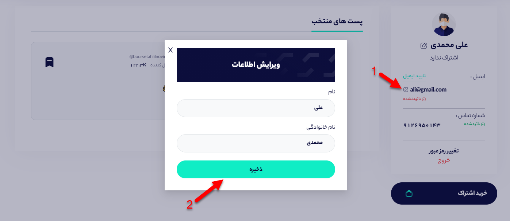
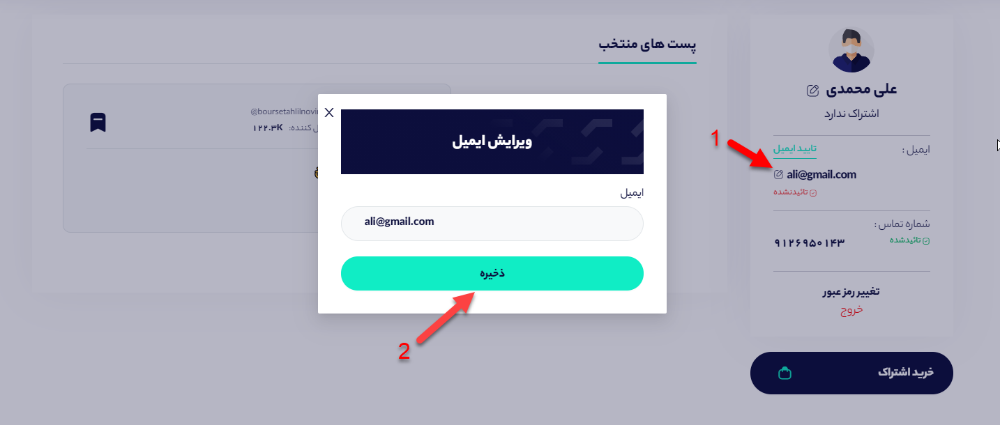

# پروفایل

صفحه پروفایل حاوی اطلاعات شخصی شما از نام و نام خانوادگی گرفته تا شماره تماس و ایمیل ثبت نامی شما است. 

### 1- چگونه نام کاربری خود را تغییر دهیم؟

برای این کار در ابتدا به بخش پروفایل وارد می‌شوید و سپس روی علامت ادیت که در تصویر زیر با شماره 1 مشخص شده است کلیک کنید سپس بعد از تغییر نام و نام خانوادگی روی گزینه ذخیره کلیک کنید تا تغییرات اعمال شده ذخیره شوند.

### 2- چگونه ایمیل خود را تغییر دهیم؟

در قسمت پروفایل روی علامت ادیت که در تصویر با شماره 1 مشخص شده است کلیک کنید تا پاپ آپ باز شود سپس بعد از تغییر ایمیل روی گزینه ذخیره کلیک کنید تا تغییرات اعمال شود. 

### 3- چگونه ایمیل کاربری خود را تایید کنیم؟

برای تایید ایمیل کافیست روی نوشته سبز رنگ با محتوای **تایید ایمیل** کلیک کنید تا ایمیلی حاوی کد تایید برای شما ارسال شود. سپس کد تایید را در پاپ آپ باز شده بنویسید و دکمه **تایید ایمیل** را کلیک کنید تا ایمیل شما تایید گردد.

### 4- نمایش پست‌های منتخب شده

در بخش پست های منتخب شده می‌توانید تمامی پیام‌هایی که  توسط شما منتخب شده‌اند را در یکجا مشاهده کنید.

