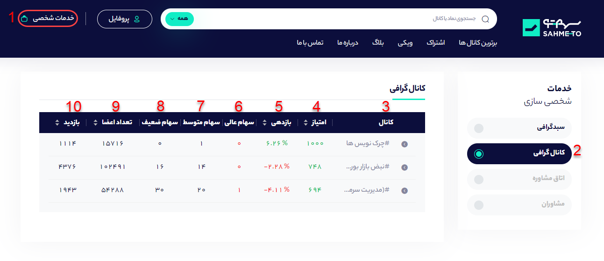

# کانال گرافی

برای اینکه به بخش کانال گرافی وارد شوید و بتوانید کانال‌های تلگرامی که قبلا بوکمارک کرده‌اید در یکجا مشاهده کنید در ابتدا باید روی گزینه دیده‌بان که در تصویر زیر با عدد **1** مشخص شده است کلیک کنید. سپس از منو مشخص شده گزینه کانال گرافی \(عدد2\)را انتخاب کنید تا کانال‌هایی که از صفحه هر کانال بوکمارک کرده‌اید در این بخش مشاهده کنید.

**3- کانال:** در این بخش نام کانال‌هایی که از صفحه کانال بوکمارک کرده‌اید را می‌توانید مشاهده کنید. 

**4- امتیاز:** در این بخش امتیاز سهمتو به کانال قابل مشاهده است که این امتیاز بر اساس بازدهی ماهانه سبد پیشنهادی کانال داده می‌شود.

**5- بازدهی:** این بخش بازدهی سبد پبشنهادی کانال در ماه اخیر را نشان می‌دهد. در واقع این بخش نشان‌دهنده‌ی عملکرد کلی کانال در بخش سیگنال دهی است.

**6- سهام عالی:** سهم معرفی شده در کانال اگر در بازه یک ماه نسبت به شاخص کل بازدهی بالاتری داشته باشد، سهمتو آن سهم را سهام عالی در نظر می‌گیرد و در اینجا می‌توانید تعداد سهام عالی معرفی شده توسط کانال منتخب شده را مشاهده کنید.

**7- سهام متوسط:** سهم معرفی شده در کانال اگر در بازه یک ماه نسبت به شاخص کل بازدهی برابری داشته باشد، سهمتو آن سهم را سهام متوسط در نظر می‌گیرد و تعداد آن در این بخش آورده می‌شود.

**8- سهام ضعیف:** سهم معرفی شده در کانال اگر در بازه یک ماه نسبت به شاخص کل بازدهی پایین تری داشته باشد، سهمتو آن سهم را سهام ضعیف در نظر می‌گیرد و تعداد آن را می‌توانید در این بخش مشاهده کنید.

**9- تعداد اعضا:** در این بخش تعداد اعضای کانال در همان روز نشان داده می‌شود.

**10: بازدید:** در این بخش نشان‌دهنده‌ی میانگین بازدید هر پست کانال تلگرامی است.

