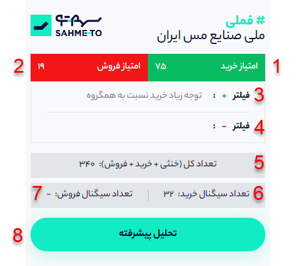

# افزونه سهمتو

### افزونه سهمتو چیست؟

افزونه سهمتو روی مرورگر کروم یا فایرفاکس شما نصب می شود و باعث افزوده شدن امکاناتی برای تحلیل سهام بر اساس اطلاعات شبکه‌ اجتماعی تلگرام می‌شود. با استفاده از سهمتو می‌توانید به سرعت نظر تحلیل‌گران بازار سهام در تلگرام را در مورد هر سهام بدانید.

### افزونه سهمتو چگونه کار می کند؟

با باز کردن صفحه هر سهام در سایت‌های بورسی معتبر مانند TSETMC، کدال، سهامیاب و رهاورد میتوانید اطلاعات شبکه اجتماعی هر سهام را در لحظه مشاهده کنید. 

**1-امتیاز خرید:** سیگنال‌های مختلفی که برای هر سهم در کانال‌های تلگرامی ثبت می‌شوند، از نظر امتیاز با یکدیگر متفاوت هستند. هر چه سیگنال خرید جدیدتر باشد امتیاز و اعتبار آن بالاتر است، به طوری که جدیدترین سیگنال امتیاز 100 و قدیمی ترین سیگنال امتیاز 0 را دریافت می‌کند. میانگین این امتیازها برای تمام سیگنال‌های یک سهم، به صورت امتیاز آن سهم در بخش نماد نمایش داده می‌شود که عددی بین 0 تا 100 است.

**2- امتیاز فروش:** هر چه سیگنال های فروشی کانال‌های تلگرامی در مورد سهم داده‌اند جدیدتر باشد، نماد امتیاز فروش بالاتری خواهد داشت.

**3- فیلتر مثبت:**

**4- فیلتر منفی:**

**5- تعداد کل سیگنال ها \( خنثی، خرید، فروش\):**

**6- تعداد سیگنال خرید:**

**7- تعداد سیگنال فروش:**

**8- تحلیل پیشرفته:**

\*\*\*\*

\*\*\*\*

