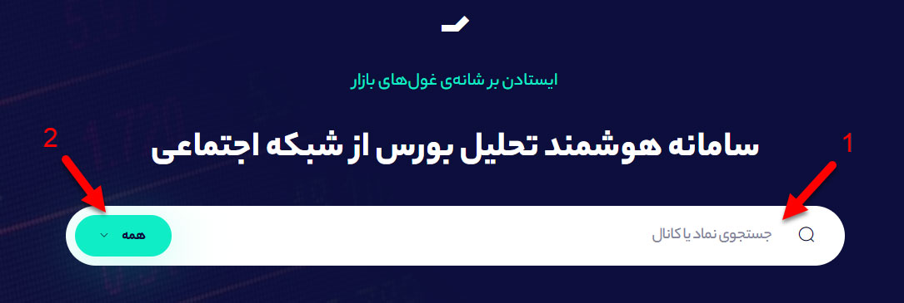
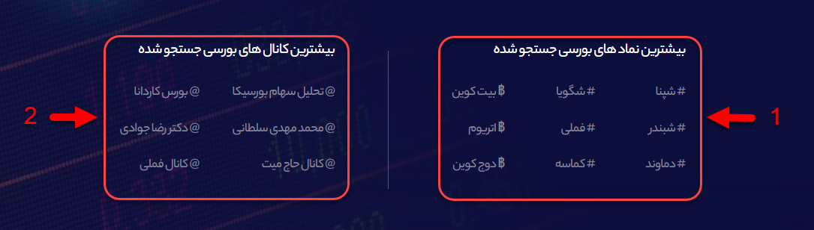

# صفحه اول

**شما اگر به صفحه اول** [**سهمتو**](https://sahmeto.com/) **وارد شوید بخش‌های مختلفی را مشاهده می‌کنید که با استفاده از هر بخش می‌توانید اطلاعات مهمی را مشاهده کنید. در ادامه بخش‌های مختلف صفحه اول سهمتو و نحوه‌ی استفاده از آن را کامل توضیح خواهیم داد.** 

### چگونه نمادها و کانال‌های بورسی را جستجو کنیم؟

**برای جستجو نمادها و کانال‌های بورسی مختلف کافیست از قسمت جستجو که در تصویر با عدد 1 مشخص شده است، نماد و کانال مورد نظر خود را جستجو کنید و سپس روی آن کلیک کنید. فیلتر جستجو در حالت پیش فرض روی جستجوی روی همه نمادها، کانال‌ها، رمزارزها تنظیم شده است اما شما در صورت نیاز می‌توانید روی بخش 2 یا فیلتر جستجو کلیک کنید و یکی از شاخه‌های \( نماد، رمزارز، کانال\) را برای جستجو انتخاب کنید.** 

### **چگونه بیشترین نمادها و کانال‌های بورسی جستجو شده را پیدا کنیم؟**

**در پایین باکس جستجو، شما می‌توانید نمادها و رمزارزهایی که کاربران سهمتو بیشتر جستجو کرده‌اند را مشاهده کنید. همانطور که در تصویر زیر مشاهده می‌کنید در بخش 1، نمادها و رمرارزهایی که کاربران سهمتو بیشتر جستجو کرده‌اند \(شپنا، شگویا، بیت کوین و...\) را می‌توانید مشاهده کنید و در بخش 2 نیز کانال‌های بورسی که بیشتر توسط کاربران سهمتو جستجو شده‌اند قرار گرفته است.** 

