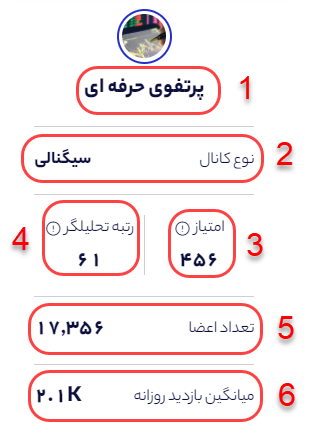
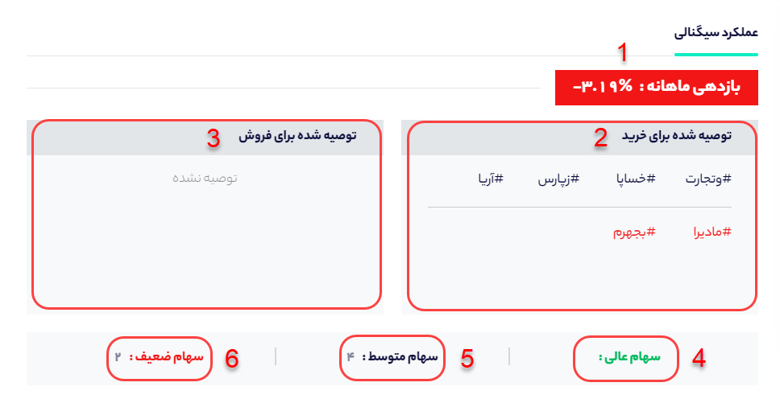

# صفحه کانال

در صفحه کانال شما می‌توانید اطلاعاتی از سبد سهام پیشنهادی کانال، میزان بازدهی سبد سهام و اینکه میزان بازدهی هر سهم نسبت به بازار چقدر بوده است را مشاهده کنید.

**الف- اطلاعات کلی کانال:**

در این بخش می‌توانید اطلاعات کلی کانال نظیر نام، رتبه کانال، نوع کانال و... را مشاهده کنید.

**1- نام کانال:** همانطور که در تصویر بالا مشخص است در کادر **1**، نام کانال آمده است که در اینجا پرتفو حرفه ای است.

**2- نوع کانال:** در سهمتو کانال‌های تلگرامی به دو نوع سیگنالی و تحلیلی دسته بندی شده‌اند. کانال‌های سیگنالی، کانال‌هایی هستند که سیگنال خرید و فروش می‌دهند و کانال‌های تحلیلی تنها به ارائه تحلیل کلی از بازار بسنده می‌کنند و سیگنال مشخصی ارائه نمی‌کنند.

**3- امتیاز کانال:** سهمتو بر اساس بازدهی سهم‌های معرفی شده توسط هر کانال تلگرامی بورسی امتیازی از 0 تا 1000 به کانال تخصیص می‌دهد. کانالی که بیشترین بازدهی ماهانه را ثبت کرده باشد امتیاز 1000 به آن تعلق می‌گیرد و کانال‌هایی که کمترین بازدهی را دارند امتیاز 0 می‌گیرند. در عکس فوق کانال پرتفو حرفه‌ای امتیاز 456 از 1000 را از دید سهمتو گرفته است.

**4- رتبه تحلیلگر:** سهمتو بر اساس امتیازی که کانال می‌گیرد، رتبه‌ای به کانال در بین کانال‌های تلگرامی بورسی تخصیص می‌دهد. به عنوان مثال در اینجا کانال پرتفو حرفه ای در بین 512 کانال بورسی، رتبه 61 را گرفته است.

**5- تعداد اعضا:** در این بخش تعداد اعضای کانال در همان روز نشان داده می‌شود. 

**6- میانگین بازدید روزانه:** در این بخش نشان‌دهنده‌ی میانگین بازدید هر پست کانال تلگرامی است. 

### ب- عملکرد کانال

در این قسمت عملکرد کانال تلگرامی در بخش سیگنال‌دهی مورد ارزیابی قرار می‌گیرد و شما می‌توانید عملکرد ماهانه کانال را بسنجید.

**1- بازدهی ماهانه :** این بخش بازدهی سبد پبشنهادی کانال در ماه اخیر را نشان می‌دهد. در واقع این بخش نشان‌دهنده‌ی عملکرد کلی کانال در بخش سیگنال دهی است.

**2- توصیه شده به خرید:** در این بخش شما می‌توانید ببینید که کانال موردنظر چه سهم‌هایی را در ماه اخیر توصیه به خرید کرده است. 

**3- توصیه شده به فروش:** در این بخش شما می‌توانید ببینید که کانال موردنظر چه سهم‌هایی را در ماه اخیر توصیه به فروش کرده است. ****

**4- سهام عالی:** سهم معرفی شده در کانال اگر در بازه یک ماه نسبت به شاخص کل بازدهی بالاتری داشته باشد، سهمتو آن سهم را سهام عالی در نظر می‌گیرد که با رنگ سبز مشخص شده است.

**5- سهام متوسط:** سهم معرفی شده در کانال اگر در بازه یک ماه نسبت به شاخص کل بازدهی برابری داشته باشد، سهمتو آن سهم را سهام متوسط در نظر می‌گیرد که با رنگ سرمه‌ای مشخص شده است.

**6- سهام ضعیف:** سهم معرفی شده در کانال اگر در بازه یک ماه نسبت به شاخص کل بازدهی پایین تری داشته باشد، سهمتو آن سهم را سهام ضعیف در نظر می‌گیرد که با رنگ قرمز مشخص شده است.

\*\*\*\*

\*\*\*\*

