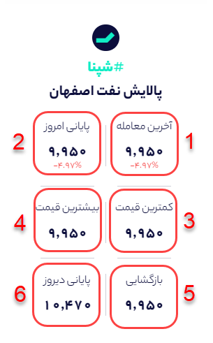
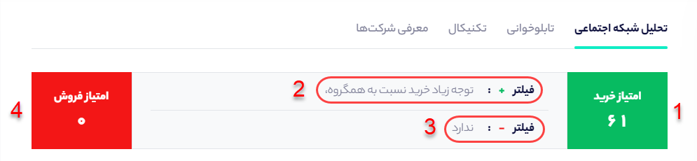

# صفحه نماد

درصفحه نماد اطلاعات مهمی مانند داده‌های شبکه‌های اجتماعی، اطلاعات بنیادی سهم، وضعیت تابلوخوانی و تکنیکال آورده شده است که هر بخش را به صورت کامل توضیح خواهیم داد. 

### اطلاعات قیمتی سهم

زمانی که وارد صفحه نماد می‌شوید در بخش راست می‌توانید اطلاعات قیمتی مربوط به نماد را مشاهده کنید که هر یک مفهوم خاصی را دارد. 

**1- آخرین معامله:** نمایش دهنده قیمت آخرین معامله سهم در هنگام باردید از صفحه معاملات است.

**2- پایانی امروز:** نمایش دهنده میانگین موزون قیمت‌های معامله شده سهم در روز آخر معاملاتی را نشان می‌دهد.

**3- کمترین قیمت:** این بخش نمایش دهنده کمترین قیمتی است که سهم در آخرین روز معاملاتی معامله شده است.

**4- بیشترین قیمت:** این بخش نمایش دهنده بیشترین قیمتی است که سهم در آخرین روز معاملاتی معامله شده است.

**5- بازگشایی:** اولین قیمتی که سهم در آخرین روز معامله شده است را نشان می‌دهد.

**6- پایانی دیروز:** نمایش دهنده میانگین موزون قیمت‌های معامله شده سهم در روز معاملاتی قبل را نشان می‌دهد.

### امتیاز خرید و فروش هر نماد چیست؟

سهمتو برای اینکه شما بتوانید به ارزیابی مشخصی از وضعیت سهم در شبکه‌های اجتماعی برسید، امتیازی برای سیگنال‌های خرید و فروش سهم تعیین کرده است. مبنای این امتیاز دهی به اینگونه است که هر چه سیگنال خرید یا فروش یک نماد جدیدتر باشد، امتیاز و اعتبار آن بالاتر می‌رود. به  طوری که جدیدترین سیگنال امتیاز 100 و قدیمی ترین سیگنال امتیاز 0 را دریافت می‌کند. میانگین این امتیازها برای تمام سیگنال‌های یک سهم، به صورت امتیاز آن سهم در بخش نماد نمایش داده می‌شود که عددی بین 0 تا 100 است. عدد **1** و **4** تصویر امتیاز خرید و فروش یک سهام را مشخص کرده است. 

**نکته : هر چه امتیاز خرید از فروش بالاتر باشد بدین معناست که سیگنال های خریدی که برای سهم داده شده است نسبت به سیگنال های فروش سهم تازه تر است.**

بخش 2 و 3 که در تصویر زیر مشخص شده است فیلترهای مثبت و منفی سهم در شبکه‌های اجتماعی را نشان می‌دهد. به عنوان مثال اگر به طور ناگهانی سیگنال‌های خرید زیادی در مورد سهم در کانال‌های بورسی صادر گردد، سهمتو این موضوع را به عنوان یک فیلتر مثبت در نظر می‌گیرد و در بخش فیلتر مثبت می‌آورد. 

\*\*\*\*

